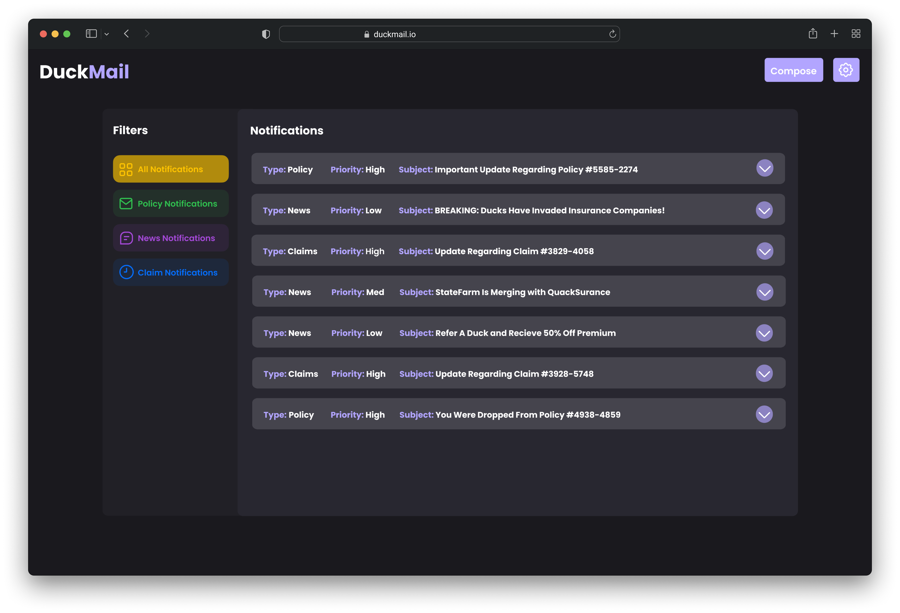
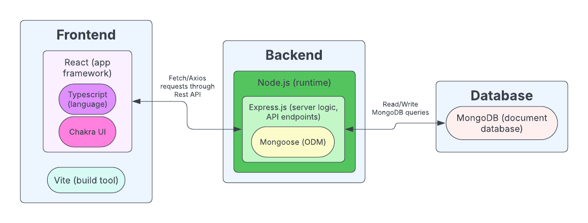
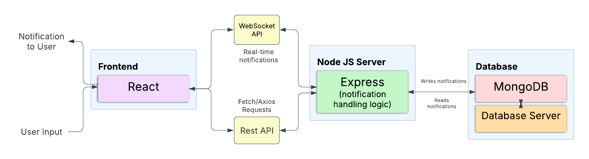
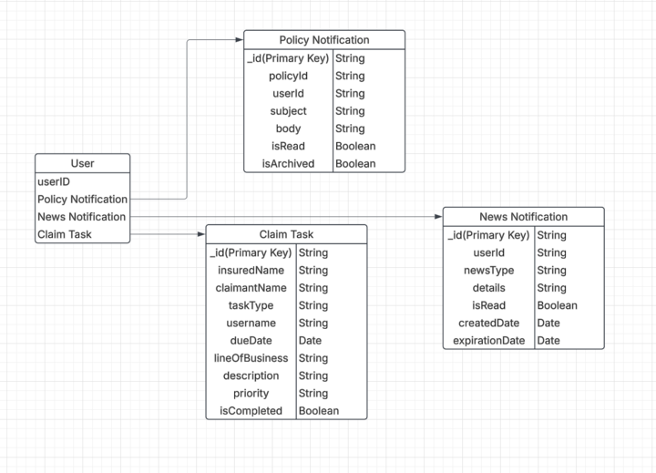

# DuckMail (NaaS)

## Abstract
The purpose of this project is to create a NaaS system (Notifications as a Service) for centralizing all notifications across various insurance products into one unified inbox. This project is being conducted by Team Quackers for the course CS320 at the University of Massachusetts Amherst.

## Introduction
Insurance software platforms often have fragmented notification systems, leading to inconsistent user experiences across products. Our solution aims to abstract and unify the notification experience by providing a centralized API layer and a shared user interface. Through this project, our team has designed and implemented a cloud-ready service that simplifies the process of sending and receiving notifications, while supporting a future roadmap for plugin integrations and AI-powered assistance.

## Minimum Viable Product (MVP)

The core features of this system are centered around delivering a **centralized**, **secure**, and **extensible notification experience**. The MVP was developed with five primary goals:

1. **Centralized Read**: A unified inbox interface aggregates all notifications—including email and in-app messages allowing users to view all relevant communications in one place.
2. **Send Notifications**: Users and systems can send both in-app and email notifications via a simplified interface and standardized API endpoints.
3. **Reply**: The platform supports bidirectional communication, enabling users to generate new notifications directly from the inbox view.
4. **Data Management**: DuckMail's backend stores and manages multiple types of notifications.
5. **Authentication**: Access to the system is gated by a secure login process, ensuring that only authorized users can send and view messages, with sender and recipient identity managed throughout.

These features establish a strong foundation for expansion into additional channels (e.g., Slack, Teams) and intelligent assistant tools in future iterations.

## Technology Stack

The NaaS platform is designed using a modern, modular technology stack that emphasizes **scalability**, **performance**, and **developer efficiency**. The **frontend** is built with **React** and **TypeScript**, enabling component-based architecture and type safety, while **Vite** ensures fast build times and a smooth development experience. For UI design, we utilized **Chakra UI**, which provides a robust set of prebuilt components that accelerate development and promote design consistency.

On the **backend**, we employed **Node.js** with **Express.js**, allowing us to build performant APIs with clean routing and middleware support. This framework provides a flexible foundation for server-side logic and integration with external services. For **data storage**, we selected **MongoDB** due to its flexibility in handling both structured and unstructured data and its inherent scalability. **Python** was incorporated alongside MongoDB to efficiently manage complex data transformations and retrievals, especially for future extensibility of notification types and AI-based features.

This architecture is illustrated in the diagram below, which outlines the interaction between frontend components, backend services, and the data layer.

  
   
  <em>Figure 1: Tech Stack Diagram</em>

## Architecture

  
   
  <em>Figure 2: Architecture Diagram</em>

The architecture of NaaS was designed with **scalability**, **real-time capability**, and **modular extensibility** in mind. At the heart of the system is a **React-based frontend**, responsible for rendering a unified inbox and handling user interactions. It communicates with a **Node.js + Express** backend through both **RESTful API** endpoints (for standard CRUD operations) and a **WebSocket API** for real-time updates, enabling instant delivery of new notifications.

On the backend, the **Express.js server** acts as the central orchestrator, managing the creation, retrieval, and dispatching of notification data. All notification-related data is stored in a **MongoDB** database, chosen for its schema flexibility and ease of horizontal scaling. This backend stack allows seamless integration with both current and future services, including potential GenAI assistants or external platforms like Slack and Teams. Our team focused on designing an architecture that not only meets immediate project goals but also supports long-term enhancements and integration plugins.

## Database

  
   
  <em>Figure 3: Database Schema Diagram</em>

The database schema was designed to reflect the **multi-type, user-centric nature** of notification data. At its core is the **User** entity, which connects to three major notification types: **Policy Notifications**, **Claim Tasks**, and **News Notifications**. Each of these represents a distinct use case relevant to the insurance domain, enabling the system to model domain-specific workflows without compromising generality.

- **Policy Notifications** contain metadata about policy updates and communication history.
- **Claim Tasks** support more complex task management with detailed attributes such as priority, due dates, and business line classifications.
- **News Notifications** are designed to inform users about broader updates, featuring expiry logic and timestamp tracking.

The schema was intentionally structured to support future extensibility. For example, new notification types could be added with minimal schema disruption. The use of **MongoDB** as a document store aligns with this goal, as it allows the backend to store different types of documents with varying structures under a unified data model.

## Conclusion
The Notifications as a Service (NaaS) system addresses a critical need in insurance software ecosystems: the centralization and standardization of user notifications. By building a unified platform that consolidates email, in-app, and future notification channels, we have laid the foundation for a more cohesive and scalable user experience across disparate applications.

Through this project, we explored the challenges of building cloud-ready services that must remain flexible and extensible. The architecture we designed allows for easy integration with existing enterprise tools and future third-party services. Our implementation of APIs and a shared inbox UI ensures that both developers and end users benefit from consistent communication workflows.

While the core goals have been achieved, the NaaS platform has potential for future enhancements—particularly in plugin support and AI-driven integrations. As digital communication continues to evolve, systems like NaaS will play an increasingly important role in simplifying how notifications are created, sent, and managed at scale.